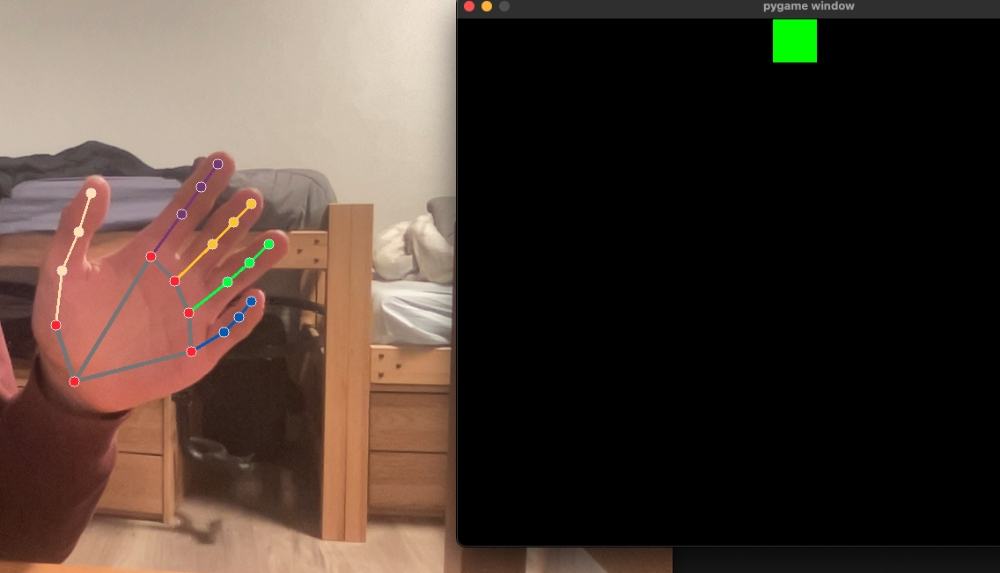

# Hand gesture recognition and control with MediaPipe
## Into to MediaPipe
What is MediaPipe, and why do we car? MediaPipe is a computer vision framework originally developed by Google that is now open-source. It is cross-platform and can be used for object classification, face and hand detection, pose recognition, and much more. In this tutorial we're only going to cover the hand tracking aspect of MediaPipe, but the other models are implemented in a similar fashion.
## Starting out
To start out we need to import mediapipe and set it up
```python
import cv2
import mediapipe as mp
import time

cap = cv2.VideoCapture(0)

mpHands = mp.solutions.hands
hands = mpHands.Hands(static_image_mode=False,
                      max_num_hands=2,
                      min_detection_confidence=0.5,
                      min_tracking_confidence=0.5)
mpDraw = mp.solutions.drawing_utils

pTime = 0
cTime = 0
```
We import cv2 here, which is a popular computer vision library that we need to capture user image and display our model's assumed hand position

After importing, we set up our model pipeline using mpHands.Hands, passing in some basic parameters

Now we can start reading data from the user's camera and running our prediction
```python
while True:
    success, img = cap.read()
    imgRGB = cv2.cvtColor(img, cv2.COLOR_BGR2RGB)
    results = hands.process(imgRGB)
    #print(results.multi_hand_landmarks)

    if results.multi_hand_landmarks:
        for handLms in results.multi_hand_landmarks:
            for id, lm in enumerate(handLms.landmark):
                #print(id,lm)
                h, w, c = img.shape
                cx, cy = int(lm.x *w), int(lm.y*h)
                #if id ==0:
                cv2.circle(img, (cx,cy), 3, (255,0,255), cv2.FILLED)

            mpDraw.draw_landmarks(img, handLms, mpHands.HAND_CONNECTIONS)


    cTime = time.time()
    fps = 1/(cTime-pTime)
    pTime = cTime

    cv2.putText(img,str(int(fps)), (10,70), cv2.FONT_HERSHEY_PLAIN, 3, (255,0,255), 3)

    cv2.imshow("Image", img)
    if cv2.waitKey(1) & 0xFF == ord('q'):
        break
```
This code stays in a loop until the escape key is pressed. In every iteration, the image data is read, converted to RGB, and processed using the hands.process function. MediaPipe gives us a convenient way to display our model's predictions using the mpDraw.draw_landmarks line, which draws the predicted hand on top of our image in real time. We also calculate the frame rate (fps), and display it in the top left corner of the output

Before running this make sure you have the proper packages installed on your computer. In terminal, run 
```
pip3 install opencv-python
pip3 install mediapipe
```
If you are on M1 mac, replace ```mediapipe``` with ```mediapipe-silicon```. Now let's run our program
```
python3 handTracking.py
```


As you can see, the model does a good job of outlining the position of our hand with a somewhat noisy background. In the top left, the framerate hovers around 15, which is a good thing to consider before implementing our model into a computationally expensive game. For a smooth gaming experience, we ideally want our frame rate at 60, which means we would not be able to run our model on every frame given the current parameters. To fix this, we could try running the model on every 3rd or 4th frame. We'll try this later on to see the performance.
## Counting the number of fingers held up
In this example, we're going to create create a short game that counts the number of fingers that the user has up and gives points if they hold up the right number of fingers. 

We'll start off with similar code for setup
```python
import cv2
import mediapipe as mp
import random
mp_drawing = mp.solutions.drawing_utils
mp_drawing_styles = mp.solutions.drawing_styles
mp_hands = mp.solutions.hands

framesLeftTillShow = 60*5
score = 0
numHoldUp = '-'
```
Next up, we once again want to implement our mediapipe model and open user input 
```python
cap = cv2.VideoCapture(0)
with mp_hands.Hands(
    model_complexity=0,
    min_detection_confidence=0.5,
    min_tracking_confidence=0.5) as hands:
  while cap.isOpened():
    success, image = cap.read()
    image = cv2.flip(image, 1)

    if not success:
      print("Ignoring empty camera frame.")
      # If loading a video, use 'break' instead of 'continue'.
      continue

    # To improve performance, optionally mark the image as not writeable to
    # pass by reference.
    image.flags.writeable = False
    image = cv2.cvtColor(image, cv2.COLOR_BGR2RGB)
    results = hands.process(image)

    # Draw the hand annotations on the image.
    image.flags.writeable = True
    image = cv2.cvtColor(image, cv2.COLOR_RGB2BGR)

    # Initially set finger count to 0 for each cap
    fingerCount = 0
```
We use "with" above instead of declaring our model outright, but both versions work fine. Now we need to check our output and add user score if they hold up the correct number of fingers.
```python
if results.multi_hand_landmarks:

      for hand_landmarks in results.multi_hand_landmarks:
        # Get hand index to check label (left or right)
        handIndex = results.multi_hand_landmarks.index(hand_landmarks)
        handLabel = results.multi_handedness[handIndex].classification[0].label

        # Set variable to keep landmarks positions (x and y)
        handLandmarks = []

        # Fill list with x and y positions of each landmark
        for landmarks in hand_landmarks.landmark:
          handLandmarks.append([landmarks.x, landmarks.y])

        # Test conditions for each finger: Count is increased if finger is 
        #   considered raised.
        # Thumb: TIP x position must be greater or lower than IP x position, 
        #   deppeding on hand label.
        if handLabel == "Left" and handLandmarks[4][0] > handLandmarks[3][0]:
          fingerCount = fingerCount+1
        elif handLabel == "Right" and handLandmarks[4][0] < handLandmarks[3][0]:
          fingerCount = fingerCount+1

        # Other fingers: TIP y position must be lower than PIP y position, 
        #   as image origin is in the upper left corner.
        if handLandmarks[8][1] < handLandmarks[6][1]:       #Index finger
          fingerCount = fingerCount+1
        if handLandmarks[12][1] < handLandmarks[10][1]:     #Middle finger
          fingerCount = fingerCount+1
        if handLandmarks[16][1] < handLandmarks[14][1]:     #Ring finger
          fingerCount = fingerCount+1
        if handLandmarks[20][1] < handLandmarks[18][1]:     #Pinky
          fingerCount = fingerCount+1

        # Draw hand landmarks 
        mp_drawing.draw_landmarks(
            image,
            hand_landmarks,
            mp_hands.HAND_CONNECTIONS,
            mp_drawing_styles.get_default_hand_landmarks_style(),
            mp_drawing_styles.get_default_hand_connections_style())

    # Display finger count
    framesLeftTillShow -= 1
    if framesLeftTillShow is 0:
      numHoldUp = random.randint(2,10)
      framesLeftTillShow = 60*2
    if numHoldUp is fingerCount:
      score += 1

    cv2.putText(image, str(numHoldUp), (50, 150), cv2.FONT_HERSHEY_SIMPLEX, 3, (0, 255, 0), 10)
    cv2.putText(image, 'Score: ' + str(score), (450, 150), cv2.FONT_HERSHEY_SIMPLEX, 3, (0, 255, 0), 6)
    cv2.putText(image, str(fingerCount), (50, 450), cv2.FONT_HERSHEY_SIMPLEX, 3, (255, 0, 0), 10)

    # Display image
    cv2.imshow('MediaPipe Hands', image)
    if cv2.waitKey(1) & 0xFF == ord('q'):
        break
cap.release()
```
The code above keeps track of measuring the number of fingers held up, drawing landmarks in out output, and writing the goal, score, and fingerCount values to the screen. We also introduced a framesLeftTillShow variable in this code that counts down the number of frames left before the goal number is supposed to be updated. We set it at 120 frames after it expires, which comes out to be around 6 seconds per number.

Here is a picture of the final game
</img>
## Controlling a sprite with angle of hand

<div id="back"><div id="block"></div></div>

In this example we're going to be using our hand's angle to control the direction of a green square. For this section we'll be using PyGame, which is a great python framework for creating 2d games. To start off let's import what we need and create our constants
```python
import cv2
import mediapipe as mp
import pygame
import random
from pygame.locals import ( K_UP, K_DOWN, K_LEFT, K_RIGHT, K_ESCAPE, KEYDOWN, QUIT )

# Initialize pygame
pygame.init()

# Define constants for the screen width and height
SCREEN_WIDTH = 800
SCREEN_HEIGHT = 600
rectX = (SCREEN_WIDTH-50)/2 
rectY = SCREEN_HEIGHT - 50
```
We import pygame now, and a few pygame constants for dealing with key values. In the section above we also defined our game screen's width and height, as well as our rectangle's maximum x and y values. Now let's start our game and our mediapipe model.
```python
def checkOverSides():
  global rectX, rectY
  if rectX < 0:
    rectX = 0
  if rectX > SCREEN_WIDTH - 50:
    rectX = SCREEN_WIDTH - 50
  if rectY < 0:
    rectY = 0
  if rectY > SCREEN_HEIGHT - 50:
    rectY = SCREEN_HEIGHT - 50

# Create the screen object
# The size is determined by the constant SCREEN_WIDTH and SCREEN_HEIGHT
screen = pygame.display.set_mode((SCREEN_WIDTH, SCREEN_HEIGHT))

mp_drawing = mp.solutions.drawing_utils
mp_drawing_styles = mp.solutions.drawing_styles
mp_hands = mp.solutions.hands

numHoldUp = '-'
def normalize_landmark_difs(land_a, land_b):
  magnitude = math.sqrt((land_a[0] - land_b[0])**2 + (land_a[1] - land_b[1])**2)
  dif_x = (land_b[0] - land_a[0]) / magnitude
  dif_y = (land_b[1] - land_a[1]) / magnitude
  return dif_x, dif_y

# For webcam input:
cap = cv2.VideoCapture(0)
frame_num = 0
with mp_hands.Hands( model_complexity=0, min_detection_confidence=0.5, min_tracking_confidence=0.5 ) as hands:
  while cap.isOpened():
    success, image = cap.read()
    image = cv2.flip(image, 1)
```
We made a function that checks if our user is oversides and corrects it, then we create a screen using pygame, passing in our desired width and height. We also have a normalize_landmarks function that takes in two landmarks and outputs the normalized x and y components of the hand. This is what we use to find the angle of our hand. The rest of our code is identical to the previous example. In the next section we need to once again run our model on the user's camera input and for development purposes we will continue to use mp_drawing to output our model's predictions in real time. 
```python
if not success:
      print("Ignoring empty camera frame.")
      # If loading a video, use 'break' instead of 'continue'.
      continue

    frame_num += 1
    # To improve performance, optionally mark the image as not writeable to
    # pass by reference.
    image.flags.writeable = False
    image = cv2.cvtColor(image, cv2.COLOR_BGR2RGB)
    results = hands.process(image)

    # Draw the hand annotations on the image.
    image.flags.writeable = True
    image = cv2.cvtColor(image, cv2.COLOR_RGB2BGR)

    # Initially set finger count to 0 for each cap
    fingerCount = 0
    change_x, change_y = 0, 0

    if results.multi_hand_landmarks:


      for hand_landmarks in results.multi_hand_landmarks:
        # Get hand index to check label (left or right)
        handIndex = results.multi_hand_landmarks.index(hand_landmarks)
        handLabel = results.multi_handedness[handIndex].classification[0].label

        # Set variable to keep landmarks positions (x and y)
        handLandmarks = []

        # Fill list with x and y positions of each landmark
        for landmarks in hand_landmarks.landmark:
          handLandmarks.append([landmarks.x, landmarks.y])

        # Test conditions for each finger: Count is increased if finger is 
        #   considered raised.
        # Thumb: TIP x position must be greater or lower than IP x position, 
        #   deppeding on hand label.
        if handLabel == "Left" and handLandmarks[4][0] > handLandmarks[3][0]:
          fingerCount = fingerCount+1
        elif handLabel == "Right" and handLandmarks[4][0] < handLandmarks[3][0]:
          fingerCount = fingerCount+1

        # Other fingers: TIP y position must be lower than PIP y position, 
        #   as image origin is in the upper left corner.
        if handLandmarks[8][1] < handLandmarks[6][1]:       #Index finger
          fingerCount = fingerCount+1
        if handLandmarks[12][1] < handLandmarks[10][1]:     #Middle finger
          fingerCount = fingerCount+1
        if handLandmarks[16][1] < handLandmarks[14][1]:     #Ring finger
          fingerCount = fingerCount+1
        if handLandmarks[20][1] < handLandmarks[18][1]:     #Pinky
          fingerCount = fingerCount+1

        # Draw hand landmarks 
        mp_drawing.draw_landmarks(
            image,
            hand_landmarks,
            mp_hands.HAND_CONNECTIONS,
            mp_drawing_styles.get_default_hand_landmarks_style(),
            mp_drawing_styles.get_default_hand_connections_style())
        
        change_x, change_y = normalize_landmark_difs(handLandmarks[0], handLandmarks[9])
```
Most of the code above is reused from the previous example(s), so not much to go over. The only major difference is we now call the normalize_landmark_difs function to calculate the normalized x and y components of our hand Finally we need to use the data we have to update the rectangle
```python
    # Display finger count

    #cv2.putText(image, str(numHoldUp), (50, 150), cv2.FONT_HERSHEY_SIMPLEX, 3, (0, 255, 0), 10)
    #cv2.putText(image, 'Score: ' + str(score), (450, 150), cv2.FONT_HERSHEY_SIMPLEX, 3, (0, 255, 0), 6)
    cv2.putText(image, str(fingerCount), (50, 450), cv2.FONT_HERSHEY_SIMPLEX, 3, (255, 0, 0), 10)

    # Display image
    cv2.imshow('MediaPipe Hands', image)

    screen.fill((0, 0, 0))
    surf = pygame.Surface((50, 50))
    surf.fill((0, 255, 0))
    rect = surf.get_rect()
    screen.blit(surf, (rectX, rectY))
    pygame.display.flip()

    # if (fingerCount == 3):
    #   rectX += 5
    # if (fingerCount == 2):
    #   rectX -= 5
    scale = 5
    rectX += scale * change_x
    rectY += scale * change_y
    checkOverSides()

    if cv2.waitKey(1) & 0xFF == ord('q'):
      break
cap.release()
```
Running our program, here is what the output gives us:
</img>

The square follows the movements of our hand pretty well! If you want a more responsive feel you may want to try increasing the speed of the square, but a slow speed looks a lot smoother for demo purposes.

## Conclusion
In the examples above I've gone more in depth into the hand-tracking abilities of the framework, using features such as finger count and hand angle to control in-game elements. The MediaPipe library from Google is an excellent way to integrate gesture recognition in an app without requiring knowledge or experience with machine learning models. Hopefully you can discover more interesting ways to apply MediaPipe and the power of machine learning into your next project.
## Sources
1. https://mediapipe.dev/
2. https://realpython.com/pygame-a-primer/
3. https://github.com/google/mediapipe/issues/2999

