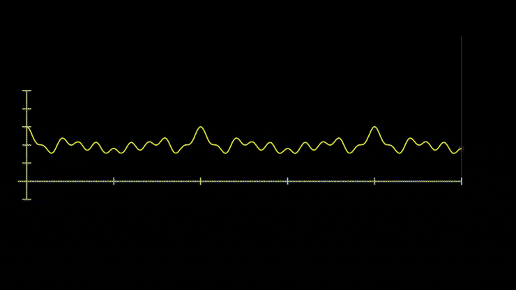

# Using Manim to Create Animations Programmatically
Have you ever watched a youtube video about math with cool animations and wonder
how on earth it was made? If your answer is yes, there's a good chance that
video was by 3blue1brown. If you don't know who or what that is, 3blue1brown is
a youtube channel created by Grant Sanderson designed to teach mathematics with
a focus on conceptual understanding through animations like this.

If you've ever wanted to learn how to create animations like the ones in his
videos, you're in the right place! In this article, we'll be looking at Manim, a
python animation library that we can use to make animations like this:

|  |
|:--:|
| [*3b1b Signal Decomposition*](https://youtu.be/spUNpyF58BY?t=131) |

By the end of this article, you will have learned the building blocks that you
need to be able to build fancy animations like this on your own. Without further
ado, let's get to it!

## Why Use Manim?
If you've ever created animations before using something like Adobe After
Effects, you may be wondering why we should use Manim in the first place. Can't
we make the same animations using GUI programs?

You definitely have a point, and Manim isn't a one size fits all
solution for animation. There are some types of animations that are simply
better suited to be made in different ways.

Where manim (and other programmatic animation software) shines is when your
animations can benefit from **leveraging the programming constructs** we know and
love, **like variables, control flow, and especially loops**.

This makes manim a great tool for **educational animations**.

## Versions of Manim
Before we dive in, it's worth it to briefly mention that there are essentially
three different versions of Manim:

1. ManimCairo
2. ManimGL
3. Manim/ManimCE

The reason for this goes back to the history of Manim and 3blue1brown, but it's
not too important for us to know to get started with making our own animations,
so I'm going to skip it. Just know that for this article, **we will be using
Manim/ManimCE**. If you are interested in learning about the differences between
each version, see [this
link](https://docs.manim.community/en/stable/faq/installation.html#:~:text=Manim%2C%20or%20ManimCE%20refers%20to,by%20Grant%20%E2%80%9C3b1b%E2%80%9D%20Sanderson.).

## Getting Started
First things first, here is the [documentation](https://docs.manim.community/en/stable/reference.html) for Manim. If you have any
questions or want more in-depth explanations, this is the place to go!
Thankfully the Manim documentation is very thorough, so be assured that you
won't be left in the dark.

### Installation
Before we can start writing our animation code, you're going to need to install
Manim by following the instructions
[here](https://docs.manim.community/en/stable/installation.html).

If you have knowledge of `conda`, a package manager for python, I recommend
going that route, as it takes care of the dependencies for you and doesn't
clutter up your system's workspace. If you haven't worked with `conda` and don't
want to bother learning about it right now, just install Manim and its
dependencies locally to your system's python to your system's python. Either
way, just follow the instructions per the link above and you'll be good to go!

### Boilerplate
Now that you have manim installed, we can finally start making our first
animation. To begin, create a new python file in your editor of choice and type
this in:

```python
from manim import *

class MyScene(Scene):
    def construct(self):
        # animation code
```

Every animation you create with manim is going to start with this. Let's break
it down:

1. `from manim import *`

    - First we import everything from manim. This gives us a bunch of prebuilt
      classes, functions, and convenience variables (e.g. `RED`, `UP`,
      etc.)

2. `class Animation(Scene):`

    - Every manim animation is a class that inherits from `Scene`, which we
      imported from manim's python library. You can name this class anything you
      want.
    - When we build our video file later using the manim program, we will need
      to specify which classname in this file we are going to use to make the
      animation
    - Since we're only starting with Manim, we'll only be needing one of these
      classes, but if you we're to compose, say, a video with several different
      *"Scenes"* (hence the superclass name), you could organize each one to be in it's own class

3. `def construct(self):`

    - `construct` is a special method that Manim will use to "construct" the
      animation
    - This is where our animation code will go

### Adding Things (MObjects) to Our Scene
MObjects (**M**anim **Object**s) are essentially the lego pieces of a manim
animation. They are the things that are displayed on the screen.

Manim's python library comes with a bunch of MObjects predefined. You can
reference the full list
[here](https://docs.manim.community/en/stable/reference.html#mobjects).

Each of these MObjects is a python class, so you create it just like you would
any other object in python.

Let's add a circle to our scene:
```python
def construct(self):
    circle = Circle(color=red, fill_opacity=0.5)
    self.add(circle)
```

Here we instantiate a `Circle` MObject into the variable `circle`. We then need
to tell manim to display that circle, which we do with the `add()` method that
comes with the `Scene` class.

### Rendering Our Scene
To actually create a media file with what we created, we need to feed our python
file into the `manim` program. To do so, we type this into the command line:
```bash
manim -qm -p <python_file> <scene_classname>
```

$\vdots$

## Sources
1. https://docs.manim.community/en/stable/index.html#
2. https://github.com/ManimCommunity/manim
3. https://github.com/3b1b
